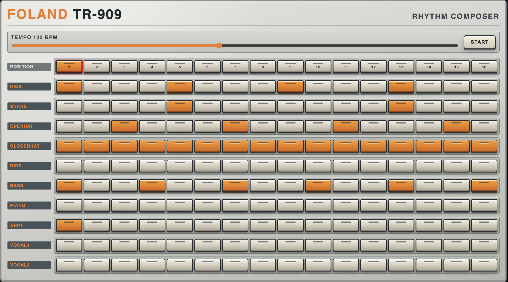

Deployed:
https://metzgerdev.github.io/Drum-Machine/

# Drum Machine
React based drum machine inspired by the Roland TR 909.  Any one can make EDM, its just a loop!!!

# DAW
Development of Drum Machine into a Daw (think a simplified Ableton)

## Setup

This project uses Bun as its package manager and task runner.

### 1. Install Bun

On macOS, install Bun with the official installer:

```bash
curl -fsSL https://bun.sh/install | bash
exec /bin/zsh
```

To confirm the install worked:

```bash
bun --version
```

### 2. Install dependencies

From the project root:

```bash
bun install
```

### 3. Start the development server

```bash
bun run dev
```

## Production build

```bash
bun run build
```

## Tests

```bash
bun test
```


