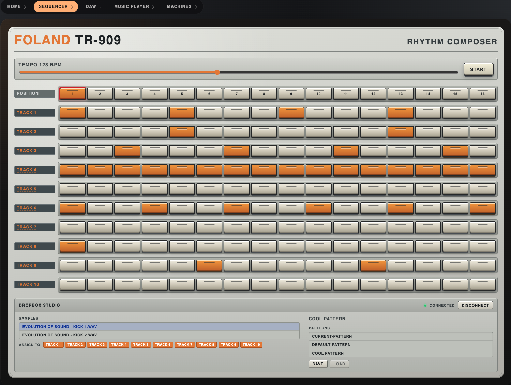
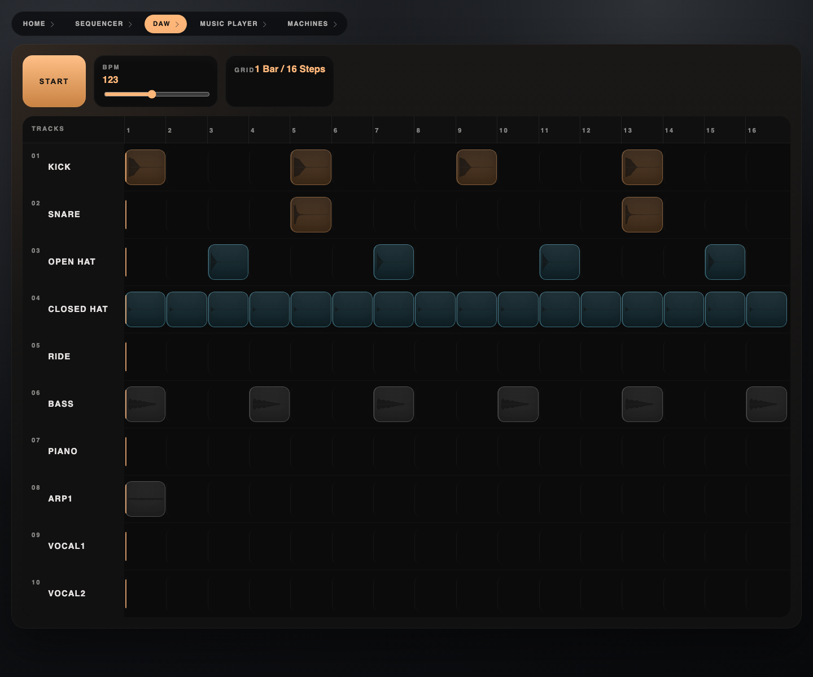
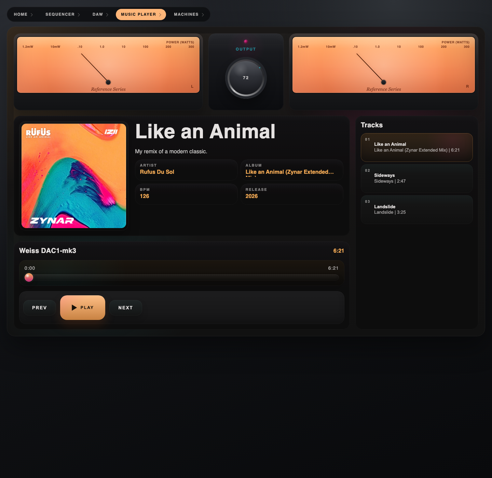

<div align="center">

# Drum Machine

React portfolio project exploring music-focused interfaces across a TR-909 inspired sequencer, a lightweight DAW, and a music player built around my own Zynar tracks.

[Live Demo](https://metzgerdev.github.io/Drum-Machine/) · [Tech Stack](#tech-stack) · [Local Setup](#local-setup)

</div>

---

> A small collection of audio products designed with the structure of modern music software and the warmer, more tactile feel of vintage studio equipment.

## Control Surface

| Module | Function |
| --- | --- |
| `SEQ-01` | TR-909 inspired step sequencer |
| `ARR-02` | Lightweight DAW / arrangement interface |
| `PLY-03` | Music player powered by a mock GraphQL data layer |

## Signal Path

This project started as a browser drum machine and evolved into a small collection of interactive audio products:

- A TR-909 inspired step sequencer
- A simplified DAW / arrangement surface
- A music player for my own music and remix work

The goal was to blend product-style frontend architecture with a more expressive visual identity than a typical demo app. The DAW work especially pushed the project toward tonal layering, clearer modular hierarchy, and a more “built” interface language.

## Screenshots

<table>
  <tr>
    <td width="50%">
      <p><strong>MODULE 01 / SEQ-01</strong></p>
      
      <p>Pattern-based drum programming with a hardware-inspired interface.</p>
    </td>
    <td width="50%">
      <p><strong>MODULE 02 / ARR-02</strong></p>
      
      <p>Arrangement-focused view built on top of the sequencer state and samples.</p>
    </td>
  </tr>
  <tr>
    <td colspan="2">
      <p><strong>MODULE 03 / PLY-03</strong></p>
      
      <p>A polished playback experience for my own tracks with a production-style data flow.</p>
    </td>
  </tr>
</table>

## Modules

### Sequencer

The original experience is a browser drum machine inspired by the Roland TR-909. It focuses on quick pattern building, tempo control, transport actions, and sample-triggered playback in a tactile interface that feels closer to a piece of hardware than a plain grid.

For performance, the audio engine and the UI are intentionally decoupled. Timing, scheduling, and sample triggering run through the Web Audio layer with refs and a lookahead scheduler, while React is responsible for editing pattern state and rendering the interface. That separation keeps playback timing tighter and avoids tying audio accuracy to React render cycles.

### DAW

The DAW view extends that sequencer into a lightweight arrangement surface. It reuses the same rhythm and sample data, then presents it as clips, tracks, and waveform-like visual structures to push the project toward a studio workflow.

It follows the same architecture as the sequencer: the audio engine continues to run independently, while the DAW layer acts as a visual surface over shared playback state. That lets the interface animate and update freely without putting extra pressure on the timing-critical audio path.

### Music Player

The Music Player is centered around my own music and remix work under the Zynar project. Instead of wiring the UI directly to static data, I used a mock GraphQL layer together with TanStack Query to simulate a more realistic frontend architecture.

It also leans on a few performance-minded frontend patterns. The route is lazy-loaded so the player code does not inflate the initial app bundle, library and track-duration requests are cached through TanStack Query, and the audio element uses metadata preloading so the UI can become responsive before full media playback begins.

### Music Player Signal Chain

That gives the player a workflow closer to a production app:

- Track data is requested through `/graphql`
- A local GraphQL schema resolves library and track queries
- TanStack Query manages loading, caching, and async UI state
- Artwork and audio previews are served as versioned app assets

This setup let me practice building a polished media interface while keeping the data model, fetching flow, and state transitions close to what I would use against a real backend.

## Tech Stack

| Area | Tools |
| --- | --- |
| Frontend | React 19, TypeScript |
| Build Tooling | Vite |
| Data Layer | GraphQL, TanStack Query |
| Runtime / Scripts | Bun |
| Testing | Bun test, Testing Library |

## Local Setup

This repo uses Bun as the package manager and task runner.

### 1. Install Bun

On macOS:

```bash
curl -fsSL https://bun.sh/install | bash
exec /bin/zsh
```

Confirm the install:

```bash
bun --version
```

### 2. Install Dependencies

```bash
bun install
```

### 3. Start The Dev Server

```bash
bun run dev
```

## Scripts

| Command | Purpose |
| --- | --- |
| `bun run dev` | Start the local development server |
| `bun run build` | Create a production build |
| `bun test` | Run the test suite |
| `bun run format` | Format the project |
| `bun run format:check` | Check formatting without writing files |
